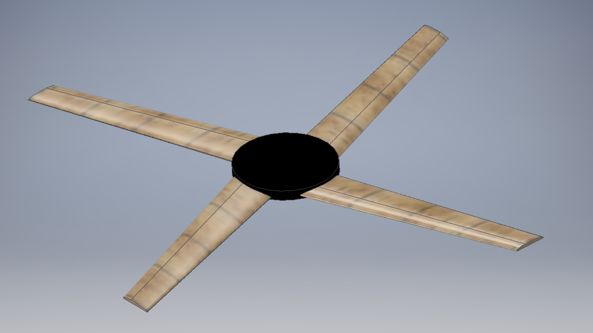
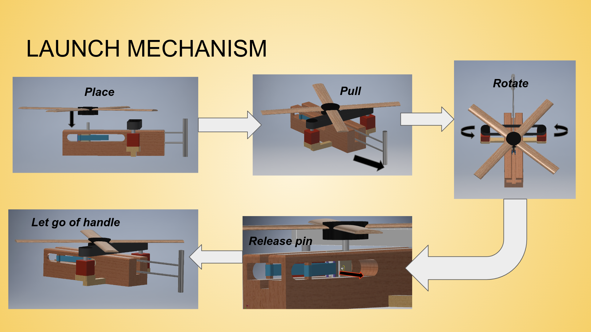

## Trajectory simulation of Boomerang by modelling non-linear equations of motion
Predicting the trajectory of boomerang is a complex task due to the complicated aerodynamics involved in the motion. In this project, we aim to compute the trajectory given a set of initial conditions at the time of launch. From the above analysis we should be able to decide how to throw the boomerang to reach a particular point in space under a specified time constraint.





### Usage
```
git clone git@github.com:meenakshiravisankar/design-of-boomerang.git
cd design-of-boomerang
pip3 install -r requirements.txt
cd simulation
python3 newmotion.py
```

The above script saves trajectory and relevant parameters as csv files


### References
1. [Flight Dynamics of the Boomerang, Part 1: Fundamental Analysis](https://arc.aiaa.org/doi/abs/10.2514/1.11157)

2. [Mathematics of Gyroscopic Precession](http://www.gyroscopes.org/math2.asp)

3. [John C. Vassberg, Boomerang Flight Dynamics, New Orleans, 2012](http://adl.stanford.edu/e298/E298_-_Seminar_in_Fluid_Mechanics_files/AIAA.2012-2650.AerodynamicsLecture2012.update.pdf)

4. [Hugh Hunt, Boomerang Theory, Cambridge, 2001](http://www2.eng.cam.ac.uk/~hemh1/boomerangs.htm)

5. [Alberto Clarich*, Rosario Russo,Enrico Nobile, Carlo Poloni, Multi-Objective Optimization of a Boomerang Shape using modeFRONTIER and STAR-CCM+](https://mdx2.plm.automation.siemens.com/sites/default/files/Presentation/3_ESTECO_AC.pdf)


